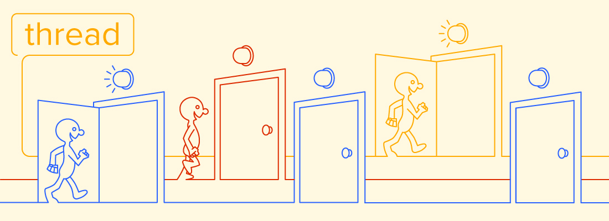

import {Image, Head, Appear, Notes} from 'mdx-deck'
import future from '@mdx-deck/themes/future'
import highlight from '@mdx-deck/themes/syntax-highlighter-prism'

export const themes = [
  future,
  highlight
]

<Image 
    src="./i/ej.jpg"
    size="auto 120%"
    style={{
        display: 'flex',
        color: 'white',
    }}
/>

<Notes>
    Меня зовут Сергей. Я работаю фронтенд-разработчиком в компании QIWI.
    Всегда хотел создавать хорошо кастомизируемые приложения малой кровью, концентрируясь на предметной области, а не над подбором библиотек, настройкой деплоя, скафолдингом и бойлерплейтом.
    Что б выбрать технологию, надо знать какие части нужны для полноценной разработки, что б как минимум, они были в фреймворке и как они реализованны.
    В своем докладе я попытаюсь пока систематизировать эти части.
</Notes>

---

### Реактивность

```jsx
<User name={name => user.name(name)} />
user.name('test') // rerender
user.name() === 'test'
```

<ul>
    <Appear>
        <li>Туда-сюда</li>
        <li>Универсальный способ из setState, hooks, dispatch</li>
        <li>Автоматизация. Динамические потоки как статические</li>
    </Appear>
</ul>

<Notes>
    Есть пользователь интерфейс, значит есть распространение изменений.
    Динамические потоки,
    Акторные модели,
    Шина событий,
    Колбэки.
</Notes>

---

```kotlin
class User {
    var name: String by Delegates.observable("") {
        prop, old, new ->
        println("$old -> $new")
    } }
user.name = "first"
```

<Notes>
    Чем раньше будет введена абстракция от реактивности, тем лучше. Не только компоненты.
</Notes>

---

## Асинхронность


<ul>
    <Appear>
        <li>Реактивность + Ненадежность</li>
        <li>Pending / Error</li>
    </Appear>
</ul>

<Notes>
    Чем раньше будет введена абстракция от реактивности, тем лучше. Не только компоненты.
    Лучше та среда, которая позволяет абстрагироваться от асинхронности без async/await и промисов на уровне языка.
</Notes>

---

```js
const user = id => toSync(fetch('/user/' + id))
user('1').name === 'John'
```

<ul>
    <Appear>
        <li>Как актуализировать данные</li>
        <li>Как работать с неготовными данными</li>
        <li>Блокировки "неготовых" частей интерфейса</li>
        <li>subscriber для чтения, action для модификации</li>
        <li>Блокировки кнопок через крутилки</li>
        <li>Автоматизация</li>
    </Appear>
</ul>

<Notes>
    Как проверить готовность данных, насколько сложно автоматизировать блокировки "неготовых" частей интерфейса.
    Использование экшенов для чтения избыточно. Популярные фреймворки не дают средств автоматизации вышеозначенных пунктов надо сравнивать трудоемкость этих действий.
    Фреймворк должен помогать управлять действиями: блокировать интерфейс, что б не сохранить одно и тоже или добавлять в очередь.
</Notes>

---

## Кэш

<ul>
    <Appear>
        <li>Для всех частей стейта, не только в компонентах</li>
        <li>Автоматический сброс</li>
        <li>Ручной сброс</li>
        <li>Унификация</li>
    </Appear>
</ul>

<Notes>
    Кэш есть везде, обычно он в компонентах (vdom, setState)
</Notes>

---

## Связывание

<ul>
    <Appear>
        <li>Сколько строк надо написать, что б добавить свойство</li>
        <li>Плагины</li>
        <li>Контексты или DI</li>
        <li>Стилизация: вещь в себе и в среде</li>
    </Appear>
</ul>

---

## Расширяемость

<ul>
    <Appear>
        <li>Компоненты отлиты в граните</li>
        <li>Сколько шаблонного кода надо написать, что б собрать новую форму из старой с новым полем</li>
    </Appear>
</ul>

<Notes>
    Сколько шаблонного кода надо написать, что б собрать новую форму из старой с новым полем.
    Сколько рефакторинга сделать, что б добавить свойство в существующий компонент.
</Notes>

---

## Отлаживаемость

<ul>
    <Appear>
        <li>Тайпскипт = тесты</li>
        <li>run-time информация об объекте: иерархия, id в интерфейсе</li>
        <li>Общие сборки с продом</li>
        <li>gz вместо минификации</li>
        <li>id у всего</li>
        <li>Остутствие рэндома в именах css-классов и картинок</li>
        <li>my_component вместо div</li>
        <li>Соответствие имени компонента и пути файла</li>
    </Appear>
</ul>

---

## Рефакторинг

<ul>
    <Appear>
        <li>Средства ide + ts language services</li>
        <li>Типы в шаблонах</li>
        <li>Уникальные имена: перемещение папки + замена в проекте</li>
    </Appear>
</ul>

---

## Ui kit

<ul>
    <Appear>
        <li>Небольшой</li>
        <li>Дизайн система</li>
        <li>Возможность выйти за ее границы</li>
        <li>Расширямый</li>
        <li>Гибкость. Возможность создать свое на основе</li>
    </Appear>
</ul>

---

## Deploy

<ul>
    <Appear>
        <li>Dev сервер</li>
        <li>Автоматизация до создания бандла</li>
    </Appear>
</ul>

---

<Image 
    src="./i/win.jpg"
    size="auto 50%"
    style={{
        display: 'flex',
        alignItems: 'top',
        justifyContent: 'center',
    }}
>

## Цельность

</Image>

<Notes>
    Фреймворк - не набор библиотек разных авторов.
    А идеологически цельная система с хорошо пригнаными друг к другу частями,
    сделанная небольшой группой людей во главе с опытным лидером.
</Notes>

---

## Дружелюбность

<ul>
    <Appear>
        <li>стары</li>
        <li>возраст открытых issue</li>
        <li>упорство автора</li>
        <li>скорость реакции автора</li>
        <li>мало кода</li>
        <li>качество сообщества</li>
    </Appear>
</ul>

---

### Насколько просто помочь проекту

<ul>
    <Appear>
        <li>быстрый успех = идиомы прошлого + локальность + тренды</li>
        <li>долгий успех = более емкие идиомы + малое их количество</li>
        <li>автоматизация программирования</li>
        <li>не писал, но осуждаю</li>
    </Appear>
</ul>

---

## Спасибо

