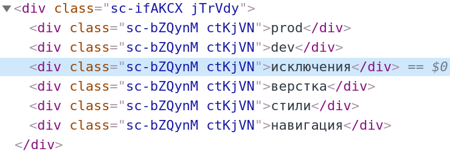

import {Flex, Image, Head, Appear, Notes} from 'mdx-deck'
import highlight from '@mdx-deck/themes/syntax-highlighter-prism'
import {default as theme} from './theme'
import {Icons, Icon, Tags, Tag, TagBox, TagHeader, TagFooter} from './components'

export const themes = [
  theme,
  highlight,
]

## Анатомия фреймворка

<Icon big src="i/human.svg"/>

Почему я люблю высокоуровневую разработку
<Icons>
  <Icon src="i/php-1.svg"/>
  <Icon src="i/drupal.svg"/>
  <Icon src="i/zend-framework.svg"/>
  <Icon src="i/symfony.svg"/>
</Icons>

<Icons>
  <Icon src="i/javascript.svg"/>
  <Icon src="i/backbone-icon.svg"/>
  <Icon src="i/nodejs-icon.svg"/>
  <Icon src="i/react.svg"/>
</Icons>
<Icons>
  <Icon src="i/typescript.svg"/>
  <Icon src="i/mol.svg"/>
</Icons>

<Notes>
    Меня зовут Сергей. Я работаю фронтенд-разработчиком в компании QIWI.
    Всегда хотел создавать хорошо кастомизируемые приложения малой кровью, концентрируясь на предметной области, а не над подбором библиотек, настройкой деплоя, скафолдингом и бойлерплейтом.
    Что б выбрать технологию, надо знать какие части нужны для полноценной разработки, что б как минимум, они были в фреймворке и как они реализованны.
    В своем докладе я попытаюсь систематизировать эти части.
</Notes>

---

<Icon src="i/github-1.svg"/>

100

immutable-di, reactive-di

<Icon src="i/dig.svg"/>

lom_atom + react = mobx + 5%

mol_atom2 + react = lom_atom + 5%

<Icons>
  <Icon big src="i/sad.svg"/>
  <Icon big src="i/react.svg"/>
  <Icon big src="i/broken_heart.svg"/>
  <Icon big src="i/brain.svg"/>
</Icons>

---

## О чем это

<Tags>
  <TagBox><TagHeader>Реактивность</TagHeader><TagFooter>ООП, ФП, react</TagFooter></TagBox>
  <TagBox><TagHeader>Асинхронность</TagHeader><TagFooter>effects, suspense</TagFooter></TagBox>
</Tags>
<Tags>
  <TagBox><TagHeader>Кэш</TagHeader><TagFooter>ручной, автоматический</TagFooter></TagBox>
  <TagBox><TagHeader>Контексты, DI</TagHeader><TagFooter>type, token, namespace</TagFooter></TagBox>
  <TagBox><TagHeader>Модули</TagHeader><TagFooter>компоненты, тесты, демки</TagFooter></TagBox>
</Tags>
<Tags>
  <TagBox><TagHeader>Локализация</TagHeader><TagFooter>ключи, deploy</TagFooter></TagBox>
  <TagBox><TagHeader>UI</TagHeader><TagFooter>адаптивный</TagFooter></TagBox>
  <TagBox><TagHeader>Отладка</TagHeader><TagFooter>сервер, exceptions, refactor</TagFooter></TagBox>
</Tags>
<Tags>
  <TagBox><TagHeader>Сообщество</TagHeader><TagFooter>живое</TagFooter></TagBox>
</Tags>

<Icons>
  <Icon big strike src="i/file.svg"/>
  <Icon big src="i/car.svg"/>
</Icons>

---

# Реактивность

<Icon big src="i/interface.svg" />

Интерфейс

<br/>

<Icon big src="i/rocket.svg" />

Изменения

<Notes>
    Есть пользователь интерфейс, значит есть распространение изменений.
    Динамические потоки,
    Акторные модели,
    Шина событий,
    Колбэки.
</Notes>

---

<Icons>
  <Icon src="i/oop.svg" />
  <Icon text="+" />
  <Icon src="i/rocket.svg" />
  <Icon text="=" />
  <Icon text="Mobx" />
</Icons>

```ts
class Counter {
    @observable count = 0
    @action.bound increment() {
        this.count++
    }
}

@observer class Example extends Component {
  counter = new Counter
  render() {
    const counter = this.counter
    return <div>
      <p>{counter.count}</p>
      <button onClick={counter.increment}>+</button>
    </div>
  }
}
```

---

<Icons>
  <Icon src="i/oop.svg" />
  <Icon text="+" />
  <Icon src="i/rocket.svg" />
  <Icon text="=" />
</Icons>
<Icons>
  <Icon text="Vue, Svelte, Glimmer" />
</Icons>
<br/>
<Icons>
  <Icon text="fp()" />
  <Icon text="+" />
  <Icon src="i/rocket.svg" />
  <Icon text="=" />
</Icons>
<Icons>
  <Icon text="CycleJS, RxReact" />
</Icons>

---

<Icons>
  <Icon text="Proc" />
  <Icon text="+" />
  <Icon text="SE" />
  <Icon text="=" />
  <Icon text="React" />
</Icons>

```jsx
function useCounter({value}) {
    const [count, setCount] = useState(value)
    const increment = () => setCount(value + 1)
    return {count, increment}
}

function Example() {
  const counter = userCounter({value: 0})
  return <div>
    <p>{counter.count}</p>
    <button onClick={counter.increment}>+</button>
  </div>
}
```

---

# ???

<Icon big src="i/holy.svg"/>
<Icons>
  <Icon big src="i/brain.svg"/>
  <Icon big text="+" />
  <Icon big src="i/house.svg"/>
</Icons>

---

## Асинхронность

<Icon big src="i/clock.svg"/>

Ожидание готовности

<br/>
<Icon big src="i/error.svg"/>

Обработка ошибок

<Notes>
    Чем раньше будет введена абстракция от реактивности, тем лучше. Не только компоненты.
    Лучше та среда, которая позволяет абстрагироваться от асинхронности без async/await и промисов на уровне языка.
</Notes>

---
### Effects

<Icons>
  <Icon src="i/action.svg"/>
  <Icon text="+"/>
  <Icon src="i/state.svg"/>
  <Icon src="i/clock.svg"/>
  <Icon src="i/action.svg"/>
  <Icon text="+"/>
  <Icon src="i/state.svg"/>
</Icons>

```jsx
function User({ user }) {
  useEffect(() => user.load(), [user.id])

  if (user.pending) return '...'
  if (user.error) return <Error retry={user.load} />

  return <div>
    User: {user.name}
  </div>
}
```

Actions + pending state

<Icon src="i/copypaste.svg"/>

---

### Suspense

<Icons>
  <Icon src="i/sleep.svg"/>
  <Icon text="+"/>
  <Icon src="i/loop.svg"/>
</Icons>


```jsx
const users = id => cache(id,
  () => fetch('/user/' + id)
)

function User({id}) {
  return <Suspense fallback={<div>Loading...</div>}>
    User: {users(id).name}
  </Load>
}
```

Cache + promise exception + rerender

Read only

---

## Когда загрузить заново?

<Icon src="i/reset.svg"/>
Mount: дернуть effect

<br/>
<br/>

<Icon src="i/action.svg"/>
Action: действие пользователя

---

# ???

<Icons>
  <Icon big src="i/action.svg"/>
  <Icon big text="vs"/>
  <Icon big src="i/sleep.svg"/>
  <Icon big text="+"/>
  <Icon big src="i/cooking.svg"/>
</Icons>
<br/>
<Icon big src="i/house.svg"/>

---

## Контексты


<br/>

<Tags>
  <Tag>Dependency injection</Tag>
  <Tag>DI</Tag>
  <Tag>Context</Tag>
  <Tag>Ambient context</Tag>
</Tags>

<Icons>
  <Icon big src="i/hierarchy.svg"/>
  <Icon big src="i/clone.svg"/>
  <Icon big src="i/rocket.svg"/>
</Icons>

Иерархия + переопределение + реактивость

---

### Контексты на ключах (React)

```jsx
const Theme = React.createContext({ fg: 'red' })

const App = () => <Theme.Provider value={{fg: 'red'}}>
  <Users/>
</Theme.Provider>

const Users = () => <Theme.Consumer>{theme =>
  <div style={{color: theme.fg}}>
    {lang}
  </div>
</Theme.Consumer>
```

<Icon big src="i/key.svg"/>

---

### Контексты на типах (Angular)

```typescript
import { HeroService } from './hero.service'

// App.component.ts
import {TestHeroService} from './test-hero.service'

@Component({
  providers: [ {provide: HeroService, useClass: TestHeroService} ],
}) export class App {}

// heroList.component.ts
export class HeroListComponent {
  constructor( heroService: HeroService ) {
    this.heroes = heroService.get()
  }
}
```
<Icons>
  <Icon src="i/typescript.svg"/>
  <Icon text="+"/>
  <Icon text="Metadata"/>
</Icons>

---

### Контексты на неймспейсах (mol)

```typescript
namespace $ {
  class $mol_object { $: typeof $ = $ }

  class Foo extends $mol_object {
    log() {
      return this.$.console.log('hello') // console from context
    }
  }
  const foo = new Foo
  foo.$ = {
    ...$,
    console: () => undefined // noop console
  }
}
```

<Icon src="i/mol.svg"/>

---

# ???

<Icons>
  <Icon big src="i/universe.svg"/>
  <Icon big text="+" />
  <Icon big src="i/typescript.svg"/>
  <Icon big text="-" />
  <Icon big src="i/copypaste.svg"/>
</Icons>

---

## Модули


<Icons>
  <Icon src="i/hierarchy.svg"/>
  <Icon text="+"/>
  <Icon text="имена"/>
</Icons>
<Tags>
  <Tag>компоненты</Tag>
  <Tag>модели</Tag>
  <Tag>тесты</Tag>
  <Tag>демки</Tag>
  <Tag>readme</Tag>
</Tags>


---

## Локализация

<Icons>
  <Icon big src="i/key.svg"/>
  <Icon big text="Text" />
</Icons>
<p>
  ключи или текст
</p>
<br/>
<Icon big src="i/lang.svg" />

---

### Текст как ключ в react-i18next

```jsx
function MyComponent () {
  const { t, i18n } = useTranslation();
  return <h1>{t('Welcome to React')}</h1>
}
```

<Icon big src="i/react.svg"/>

---

### Id в mol

```text
$my_component
  dom \h1
  sub /
    <= welcome_title @ \Welcome to React
```
<br/>
$my_component.locale=en.json

```json
{
  "$my_component_welcome_title": "Welcome to React"
}
```

<Icon big src="i/mol.svg"/>

---

# ???

<Icons>
  <Icon big src="i/key.svg"/>
  <Icon big text="+" />
  <Icon big src="i/triangle.svg"/>
  <Icon big text="+" />
  <Icon big text="util" />
</Icons>

<Tags>
  <Tag>ключи</Tag>
  <Tag>строго</Tag>
  <Tag>выгрузка</Tag>
  <Tag>сборка</Tag>
</Tags>

---

## UI

<Icon big src="i/application.svg"/>

Компоненты

<Tags>
  <Tag>навигация</Tag>
  <Tag>списки</Tag>
  <Tag>карточки</Tag>
  <Tag>кнопки</Tag>
</Tags>

<br/>

<Icon big src="i/box.svg"/>
Система

<Tags>
  <Tag>адаптивность</Tag>
  <Tag>автоматизация</Tag>
  <Tag>расширение</Tag>
</Tags>

---

### Система. Адаптивность

<video autoplay="autoplay" loop="loop">
  <source src="i/adaptive.mp4" />
</video>

<Tags>
  <Tag>flexbox</Tag>
  <Tag>перенос</Tag>
  <Tag>сворачивание</Tag>
  <Tag>tile wm</Tag>
  <Tag>auto breakpoint</Tag>
</Tags>

<Icon src="i/mobile.svg"/>

---

## Автоматизация

<video autoplay="autoplay" loop="loop">
  <source src="i/todo.mp4" />
</video>

<Tags>
  <Tag>suspense</Tag>
  <Tag>loading-компоненты</Tag>
</Tags>

<Icon big src="i/car.svg"/>

---

## Расширение

<Icons>
  <Icon big src="i/calendar-1.svg"/>
  <Icon big text="в" />
  <Icon big src="i/calendar-2.svg"/>
</Icons>

<Icon big src="i/rock.svg"/>

React, etc: надо думать заранее
<br/>
<Icon big src="i/puzzle.svg"/>

Mol заставляет писать id каждой детали

---

# ???

Через тернии к звездам

<br/>
...mol?

<Icon big src="i/brain.svg"/>

---

## Отладка


---

### Найти файл по html


---

### Random



---

### Информация об объекте


---

### React: catch

```jsx
const B = () => <div>test {qwe}</div> // Error !
const A = () => <B/>

ReactDOM.render(<ErrorCatch>
  <div>[
    <A key="1"/>
    <A key="2" />
  ]</div>
</ErrorCatch>, document.getElementById('mount'));
```

---

### React: trace


---

## Сообщество

<Tags>
  <Tag>упорство автора</Tag>
  <Tag>возраст issue</Tag>
  <Tag>работа с трекером</Tag>
  <Tag>паттерны</Tag>
  <Tag>реальные примеры</Tag>
</Tags>

Насколько просто помочь?

<Icon big src="i/family.svg"/>

<Notes>
    Фреймворк - не набор библиотек разных авторов.
    А идеологически цельная система с хорошо пригнаными друг к другу частями,
    сделанная небольшой группой людей во главе с опытным лидером.
    Плохая отлаживаемость, копипаста, следствие плохой цельности.
</Notes>

---

## Спасибо,


Юферев Сергей, [s.yuferev@qiwi.com](mailto:s.yuferev@qiwi.com)
